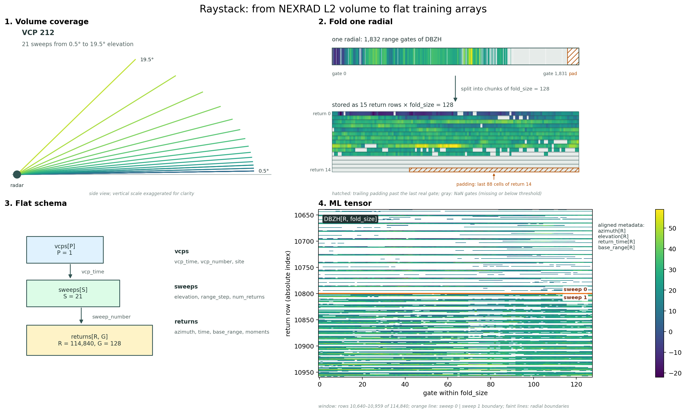
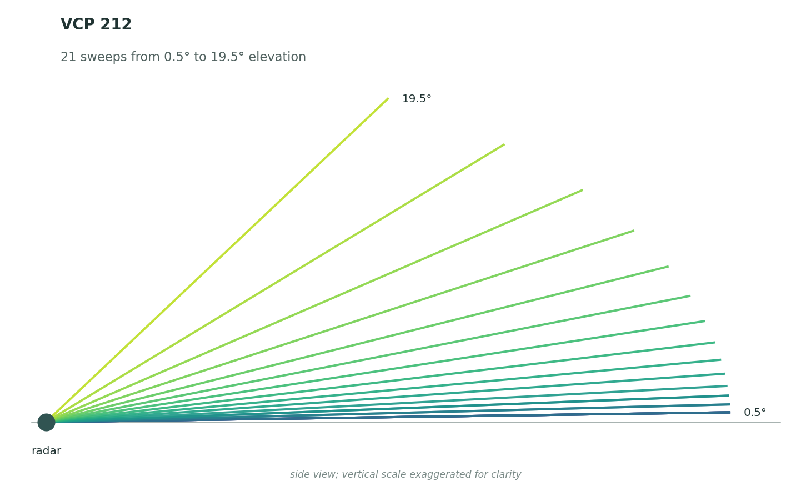
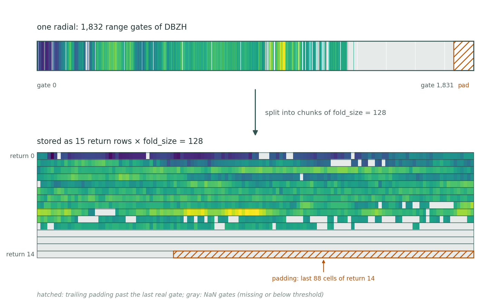
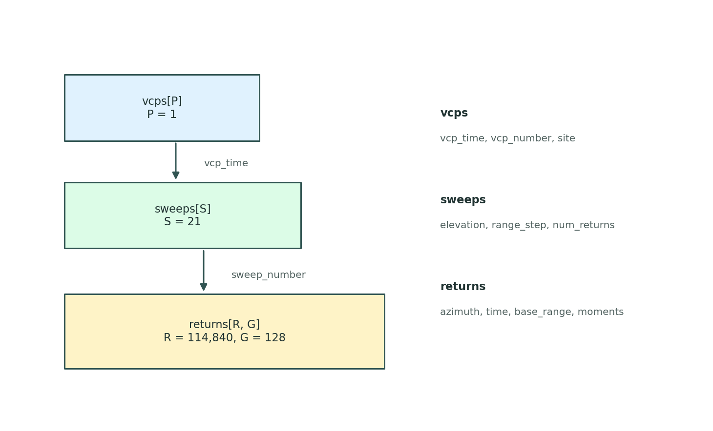
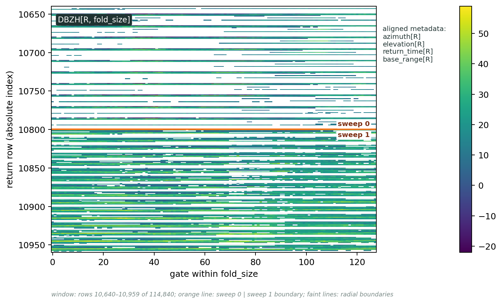

# Raystack format

`radrs.raystack` opens a NEXRAD Level 2 volume as four flat, aligned tables
instead of an xradar-style tree of per-sweep datasets. It targets workloads
that want to operate on whole volumes — or many volumes at once — as
fixed-shape tensors: ML training pipelines, batched feature extraction,
vectorized analysis across moments.

The physical structure is preserved:

```text
volume coverage pattern -> sweeps -> radials -> range gates
```

But each level lives in its own table, with a single row per VCP, sweep, or
return. Moment data (`DBZH`, `VRADH`, `RHOHV`, …) lives in the `returns`
table as 2-D arrays whose first axis matches the return-level metadata
row-for-row.



## Returns and folding

A *return* is a fixed-width chunk of range gates from a single radial. The
width is set by `fold_size`. If a radial has more gates than `fold_size`,
raystack splits it into multiple return rows; the final row is padded
where the radial runs out of gates.

With `fold_size=128`, a radial with 1,832 gates becomes 15 returns: gates
0–127, 128–255, and so on. This is why the number of returns in a volume
is typically several times the number of physical radials.

Each return row carries the metadata needed to place it back in radar
space: azimuth, elevation, time, base range, and range step.

!!! warning "`range` is a gate index, not a distance"

    The `range` coordinate runs `0 … fold_size - 1` — it is the gate's offset
    *within its fold*. Two returns at the same `range` index sit at completely
    different distances if they came from different folds or different sweeps.

    Physical range lives on the per-return `base_range` and `range_step`
    variables (both metres), so reconstruct it explicitly:

    ```python
    gate_index = returns["range"].values                       # (fold_size,)
    range_m = (
        returns["base_range"].values[:, None]
        + gate_index[None, :] * returns["range_step"].values[:, None]
    )                                                          # (n_returns, fold_size)
    ```

    `base_range` already accounts for the fold offset, so this is correct for
    trailing folds too.

Folding also sets how much memory a volume costs, which matters most when
accumulating many volumes at once — see
[Batch iteration and folding](batching.md) for the returns-per-volume
arithmetic.

## The four datasets

| Dataset | Main dimension | Contents |
| --- | --- | --- |
| `vcps` | `vcp_time` | One row per volume coverage pattern: VCP number, site location, volume timing. |
| `sweeps` | `sweep_time` | One row per sweep: elevation angle, range geometry, return count. |
| `returns` | `return_time`, `range` | One row per return: azimuth, elevation, time, range metadata, plus moment arrays (`DBZH`, `VRADH`, `RHOHV`, …). |
| `activity` | `moment` × ray/sweep/volume | Valid-count and valid-fraction summaries per moment. |

Sweep boundaries are recorded in `sweeps["num_returns"]`: each entry says
how many rows of `returns` belong to that sweep. That single column is what
keeps the flat layout aligned with the original sweep structure.

## Opening a volume

```python
import radrs.raystack as rrs

src = "s3://unidata-nexrad-level2/2024/07/02/KABR/KABR20240702_000016_V06"
rdt = rrs.open_datatree(src, fold_size=128)

vcps     = rdt["vcps"].dataset
sweeps   = rdt["sweeps"].dataset
returns  = rdt["returns"].dataset
activity = rdt["activity"].dataset
```

Moment variables come back as `(n_returns, fold_size)` matrices; the
return-level metadata arrays are 1-D and align with the first axis:

```pycon
>>> returns["DBZH"].shape
(114840, 128)
>>> returns["azimuth"].shape, returns["return_time"].shape
((114840,), (114840,))
```

That alignment is the contract the format is built around. A model can
consume `DBZH` as a dense tensor; analysis code can map any row back to
radar geometry by indexing the metadata arrays the same way.

## Slicing by sweep

`sweeps["num_returns"]` is a count per sweep; the cumulative sum gives
slice offsets into every return-level array.

```python
import numpy as np

offsets = np.r_[0, np.cumsum(sweeps["num_returns"].values)]
start, stop = offsets[sweep_index], offsets[sweep_index + 1]

dbzh    = returns["DBZH"].values[start:stop]
azimuth = returns["azimuth"].values[start:stop]
```

The same `start:stop` slice applies to every column in `returns`.

## Checking data availability

The `activity` dataset summarizes how much valid data each moment has,
already computed over the folded representation. It is the cheap way to
filter or weight volumes before sampling training batches.

```python
activity["ray_valid_fraction"]      # per (moment, return)
activity["sweep_valid_fraction"]    # per (moment, sweep)
activity["volume_valid_fraction"]   # per (moment, vcp)
```

`*_valid_count` variants give raw counts instead of fractions. A return
with all-NaN moments has fraction `0.0`; a fully populated one has `1.0`.

## Visual walkthrough

The panels below trace the same KABR volume from physical geometry to the
final arrays.

**A NEXRAD volume.** A volume is a VCP made of sweeps at different
elevations; each sweep is a sequence of radials, and each radial carries
moment values along its range gates.



**Folding a radial.** Raystack splits each radial into fixed-width rows
and keeps the metadata needed to place each row back in radar space. The
1,832 gates of this radial fill returns 0–13 completely and the first 40
gates of return 14; the hatched region is the trailing padding that fills
return 14 out to `fold_size`. Padding is NaN, but so are gates that are
missing or below the detection threshold — those are the gray cells
scattered through the real part of the radial. Nothing in the moment array
distinguishes the two, so use `sweeps["max_gates"]` when you need to know
where the real gates end.



**Flat schema.** The hierarchy lives in three aligned tables —
`vcps`, `sweeps`, `returns` — linked by `sweeps["num_returns"]`.



**Tensor view.** Each moment is a `(n_returns, fold_size)` matrix. The
panel below shows a 320-row window of `DBZH` centred on the end of sweep 0
(row 10,800): the orange line is that sweep boundary, and the faint lines
are radial boundaries — every 15 rows in sweep 0, every 10 in sweep 1,
because the two sweeps have different `max_gates`. The 1-D metadata arrays
line up row-for-row, so the same matrix is consumable as a tensor and
interpretable as radar data.


