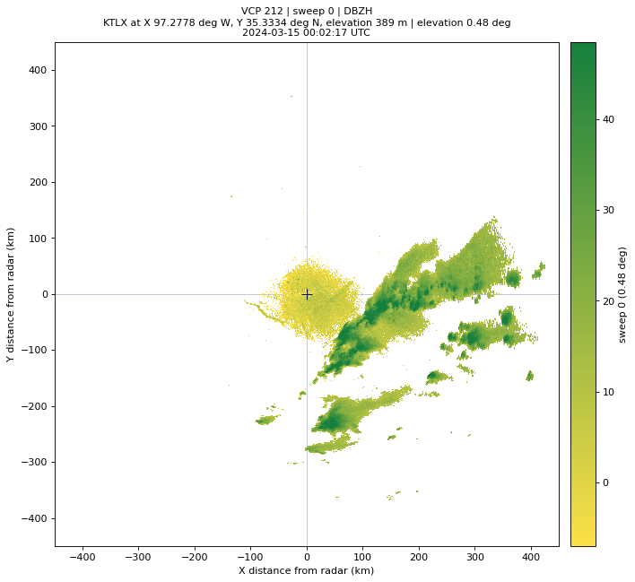
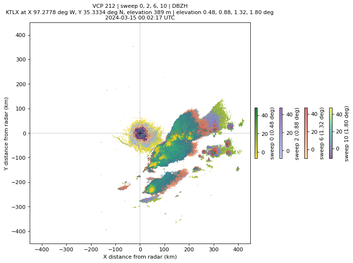
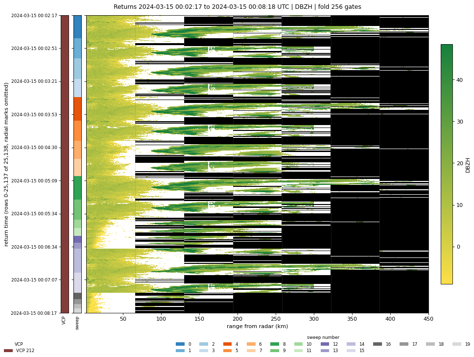
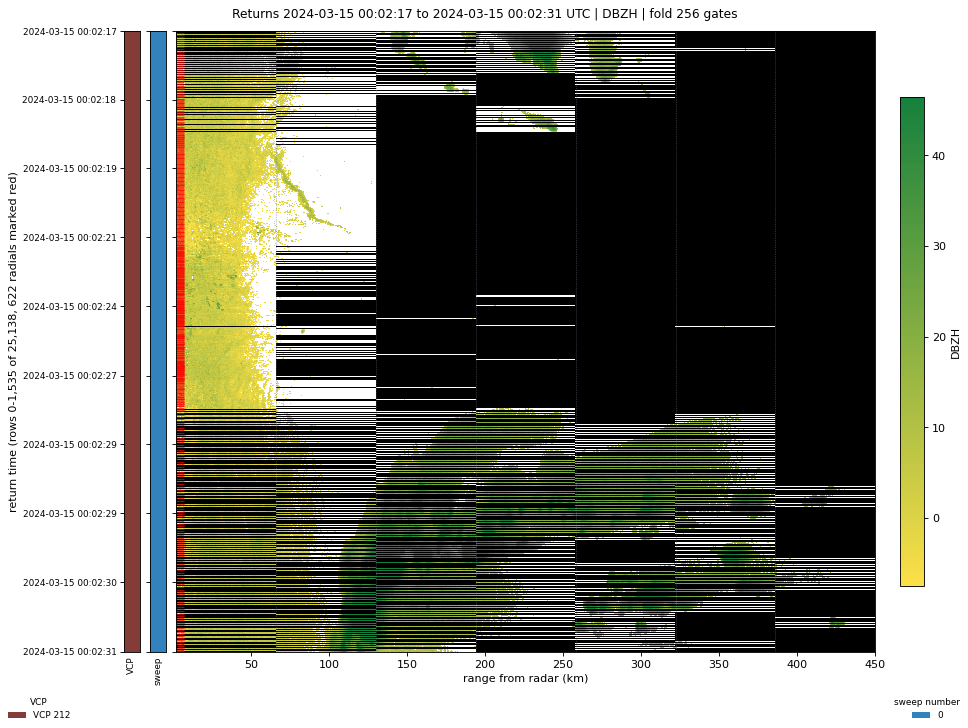

# Visualization

`radrs.viz` plots a raystack `DataTree` directly. Every function takes the tree
that `rrs.open_datatree` or `BatchedRaystack.finalize_to_rs_dt` returns, and
hands back something a notebook displays as-is: a matplotlib `(Figure, Axes)`
pair, or a [pydeck](https://deckgl.readthedocs.io) `Deck`.

Install the plotting dependencies with the `viz` extra:

```bash
pip install 'radrs[viz]'
```

Raystack returns are *folded* — each row holds `fold_size` gates starting at
that row's `base_range`, so several rows make up one radial. Every function
here unfolds first, placing each row at its true distance from the radar, which
is why the axes are in kilometres rather than gate indices. See
[Raystack format](raystack-format.md) for what folding does to the layout.

## `plot_sweep` / `plot_sweeps`

A PPI in kilometres from the radar. `plot_sweep` is the single-sweep shorthand;
`plot_sweeps` is the real implementation.

```python
import radrs.raystack as rrs
import radrs.viz as viz

src = "s3://unidata-nexrad-level2/2024/03/15/KTLX/KTLX20240315_000217_V06"
rs_dt = rrs.open_datatree(src, fold_size=256)

fig, ax = viz.plot_sweep(rs_dt, 0)
```



The title carries the VCP number, sweep number, moment, and the site's X, Y and
elevation coordinates, so a saved figure stays self-describing.

Pass several sweeps and they overlay, each in its own colormap — yellow to
green, then blue to purple, then orange to red, then matplotlib defaults. NaN
gates are transparent, so lower sweeps show through the gaps in higher ones:

```python
fig, ax = viz.plot_sweeps(rs_dt, [0, 2, 6, 10], alpha=0.6)
```



`alpha` sets the transparency of every sweep after the first, which is drawn
opaque. Colorbars stack on the right in sweep order, capped at eight.

## `plot_waterfall`

Every return drawn against true range, stacked in time — the raystack layout
itself, unfolded.

```python
fig, ax = viz.plot_waterfall(rs_dt)
```



The color rules are what make this readable:

- **Black** is range that no fold ever covered. The black wedges on the right
  are the higher sweeps, which stop far short of the 460 km surveillance cut.
- **White** is a gate that *was* sampled and came back NaN — below threshold,
  range folded, or trailing padding at the end of a radial.
- Dotted vertical lines mark where each fold window begins, every 64 km at
  `fold_size=256`.

Two strips run down the left, aligned with the rows: VCP number in `tab20b`,
ruled black at each volume boundary, and sweep number in `tab20c`. Both get a
legend underneath.

A volume is far more returns than a figure has pixels, so rows and range bins
are block-reduced to fit `max_rows` and `max_cols`. `reduce="max"` keeps echoes
crisp; use `reduce="mean"` for signed moments like `VRADH`.

### Reading the fold structure

Red ticks inside the left edge mark each distinct return time. Past ~2000
radials they would merge into a solid bar, so the function drops them and says
so on the axis. Window the rows to bring them back:

```python
fig, ax = viz.plot_waterfall(rs_dt, row_offset=0, row_count=1536)
```



Zoomed in, each radial's folds read as a staircase: consecutive rows step one
64 km window to the right, and the red ticks separate one radial from the next.
Radials that ran out of gates early leave their later windows black.

## `plot_geo`

Finite gates as a 3-D point cloud on a real-world map. Returns a `pydeck.Deck`,
which marimo and Jupyter display directly; the view rotates, so the vertical
structure of the volume is legible from the side.

```python
deck = viz.plot_geo(rs_dt, min_value=20.0)
deck.to_html("cloud.html")
```

Gates are geolocated with the standard 4/3-earth-radius refraction model, so
altitudes are above mean sea level, not above the radar. The site itself is
marked in red.

Two arguments matter more than the rest:

- `min_value` drops weak gates. Without it a whole volume of near-threshold
  returns fogs the map and hides the storm; 20 dBZ is a reasonable floor for
  `DBZH`.
- `max_points` (default 30,000) caps what gets rendered. deck.gl data travels
  as JSON at roughly 90 bytes a point, so this bounds the notebook output size.
  Gates beyond the cap are dropped by strided subsampling, which is
  deterministic — the same raystack always renders the same cloud.

`viz.gate_positions` returns the same geolocated arrays without building a
deck, if you want to feed them somewhere else.

## Exploring interactively

`notebooks/raystack_viz.py` wires all of the above to live controls. It pulls
volumes straight from the public NEXRAD archives, so it needs no local data —
the figures on this page are its defaults.

```bash
uv sync --group dev
uv run marimo edit notebooks/raystack_viz.py
```

Part 1 builds a raystack from an archive URL, instrument name, time range and
fold size; there is no load button, so editing a control re-fetches. Part 2 is
a configuration cell and a plot cell for each function above, which is the
quickest way to find the arguments you want before writing them down.

Use `marimo run` instead of `marimo edit` to open it as an app: controls only,
no source.

## Picking a moment

`available_moments` lists what a tree actually carries, QC outputs included:

```python
viz.available_moments(rs_dt)              # ['DBZH', ..., 'qc.rhohv_threshold_mask']
viz.available_moments(rs_dt, include_qc=False)
```

`vcp_infos` and `sweep_infos` describe what is selectable, with labels built
for dropdowns:

```python
[info.label for info in viz.vcp_infos(rs_dt)]
# ['00 | VCP 212 | 2024-03-15 00:02:17']

[info.label for info in viz.sweep_infos(rs_dt, vcp_num=0)]
# ['sweep  0 | elev  0.48 deg | 5,760 returns', ...]
```

`vcp_num` is an index into the VCPs in time order, not the NEXRAD pattern
number — `0` is the first volume in the raystack, whatever pattern it ran.
